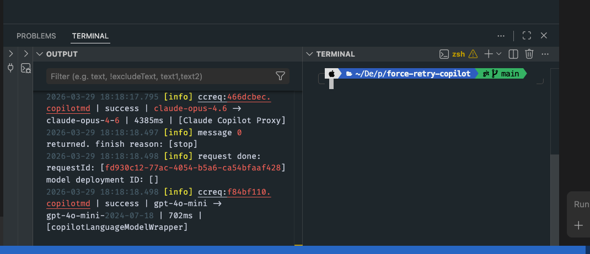

# Force Retry Copilot

A VS Code extension that automatically retries GitHub Copilot Chat when it hits `[error] Error: Error during execution`. It monitors the Copilot Chat output channel in real-time and sends "try again" on your behalf.

## Install

### From GitHub Releases (recommended)

1. Go to the [Releases](https://github.com/sh-himanshu/force-retry-copilot/releases/latest) page
2. Download the `.vsix` file from the latest release
3. Install it in VS Code:

```sh
code --install-extension force-retry-copilot-*.vsix
```

Or in VS Code: `Cmd+Shift+P` → **Extensions: Install from VSIX...** → select the downloaded file.

### From Source

```sh
git clone git@github.com:sh-himanshu/force-retry-copilot.git
cd force-retry-copilot
bun install
bun run build
bunx @vscode/vsce package --no-dependencies
code --install-extension force-retry-copilot-*.vsix
```

After installing, reload VS Code (`Cmd+Shift+P` → **Developer: Reload Window**).

## Prerequisites

For this extension to work, the **Output** panel must be open with **"GitHub Copilot Chat"** selected as the output source.



To open it: `View` > `Output` (or `Cmd+Shift+U`), then select **GitHub Copilot Chat** from the dropdown.

## Usage

Once activated, the extension shows a status bar item at the bottom-right of VS Code:

| State | Status Bar |
|---|---|
| Monitoring | `✓ Force Retry ON — max 15` |
| Retrying | `↻ Force Retry (2/15)` |
| Disabled | `⊘ Force Retry OFF` |

**Click the status bar** to open the options menu:

- **Turn ON** — Normal retry mode (max 15 retries)
- **Turn ON — Custom** — Choose max retries (3, 5, 10, 15, 20, or unlimited)
- **Turn OFF** — Disable monitoring
- **Normal Retry** — Switch to max 15 retries
- **Custom Retry** — Change the max retry count

## How It Works

1. Listens to `vscode.workspace.onDidChangeTextDocument` for output channel documents (event-driven, not polling)
2. When `[error] Error: Error during execution` appears in any output channel, triggers a retry
3. Opens the existing Copilot Chat panel and submits "try again"
4. Debounces retries (5s default) and pauses after hitting the max retry limit

## Settings

| Setting | Default | Description |
|---|---|---|
| `forceRetryCopilot.debounceMs` | `5000` | Minimum milliseconds between retries |
| `forceRetryCopilot.retryMessage` | `"try again"` | Message sent to Copilot Chat on error |

## License

MIT
